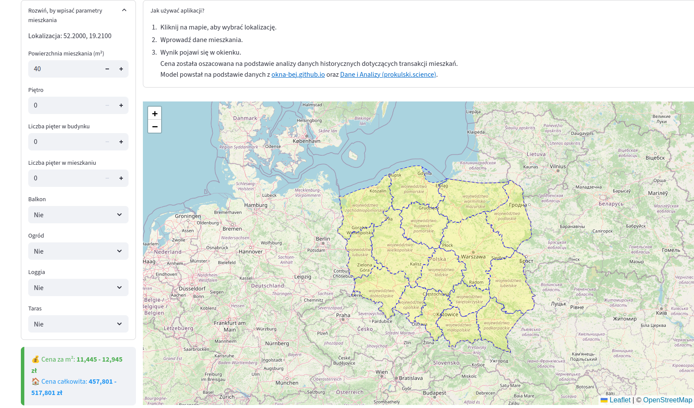

# App for apartment price prediction

An application (link: https://nieprzeplac.bieda.it/) for apartment price prediction based on user input.

# How to run

Locally through Streamlit:

``streamlit run app.py
``

Docker:

``
docker build -t app_name .
``

``
docker run -p 80:8501 app_name
``

# Screenshots:

